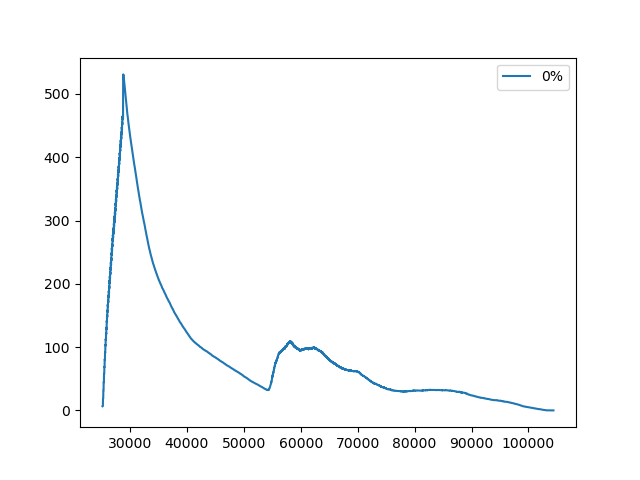
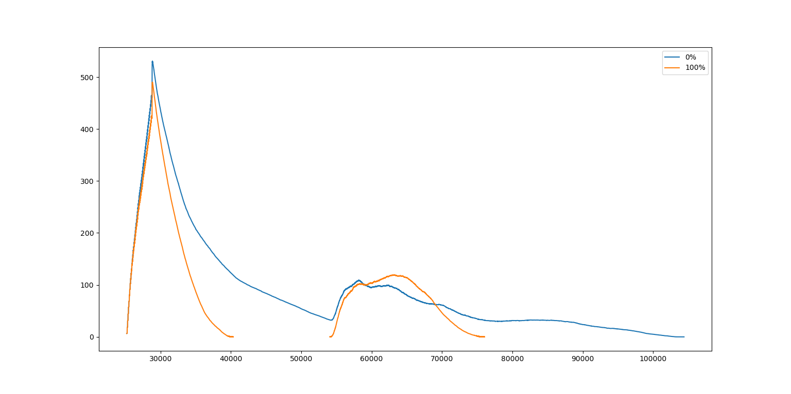

# matsim-py-vis
Python tool to compare MATSim simulation results and calculate congestion ratios.

## Difference between two simulations
Compare the flow of vehicles between two simulations. Useful for comparing the difference in traffic flows between different configurations, systems, etc.

An example of how to use it is given in the function doCompareTest.

## Congestion Ratios
There are two ways to calculate congestion ratios : hourly and by millisecond (for the time being, only the millisecond one will yeild correct results and print out a chart). 

If you want to calculate congestion ratios, you need the network / region / link capacity in the correct unit. When calculating hourly ratios, need vehicles / hour (which is how it is defined in the MATSim network), but when doing it by milliseconds need to divide the capacity by 3600000. Currently it only calculates the congestion ratio for the whole network (which follows the exact same trend as flow / volume), but there are some example on how you could calculate ratios only for residential roads. 

Ratio per millisecond for a simulation

Ratio per millisecond for two different simulations

An example of how to calculate hourly ratios is given in the function doRatioTest.

An example of how to calculate millisecond ratios is given in the function doMillisRatioTest.
