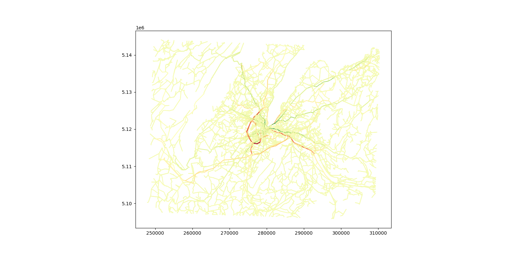
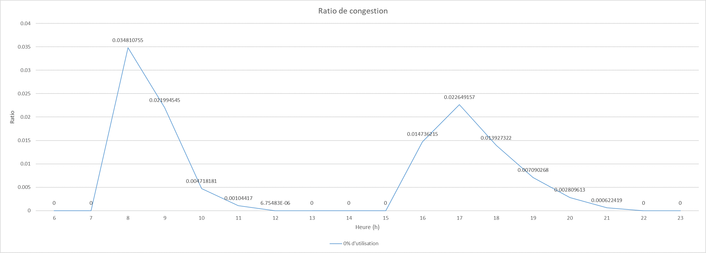

# matsim-py-vis
Python tool to compare MATSim simulation results and calculate congestion ratios.

## Difference between two simulations
Compare the flow of vehicles between two simulations. Useful for comparing the difference in traffic flows between different configurations, systems, etc.

An example of how to use it is given in the function doCompareTest.

## Congestion Ratios
Calculate the congestion ratio for each hour of a simulation.

(the following image is with the data put into an Excel sheet, it is NOT generated by this code!)

An example of how to use it is given in the function doRatioTest.
