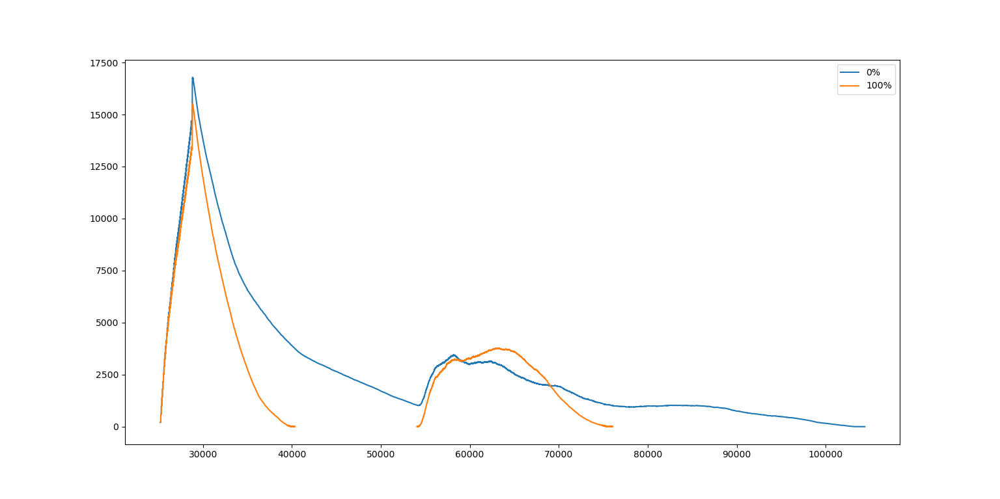

# matsim-py-vis
Python tool to compare MATSim simulation results and calculate congestion ratios.

## Difference between two simulations
Compare the flow of vehicles between two simulations. Useful for comparing the difference in traffic flows between different configurations, systems, etc.

An example of how to use it is given in the function doCompareTest.

## Congestion Ratios
There are two ways to calculate congestion ratios : hourly and by millisecond (for the time being, only the millisecond one will yeild correct results and print out a chart). 

Volumes per millisecond:

Ratio per millisecond

An example of how to calculate hourly ratios is given in the function doRatioTest.
An example of how to calculate millisecond ratios is given in the function doMillisRatioTest.
